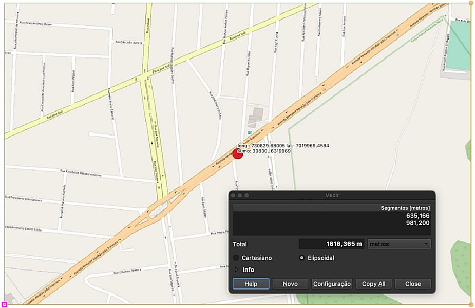

---

nome: Calibragem de um modelo de simulação de tráfego, utiliando dados de navegação móvel.
data: 2021-08-16

---

# Calibragem de um modelo de simulação de tráfego, utiliando dados de navegação móvel.

## Introdução

A partir de estimativas obtidas com dados da simulação, criar visualizações que não são possíveis apenas com os dados do feed em tempo real do Waze.

## Modelo de teste

