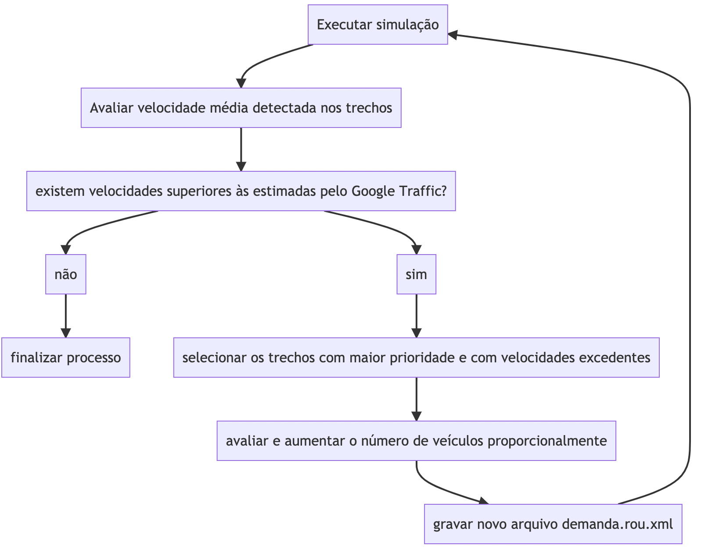
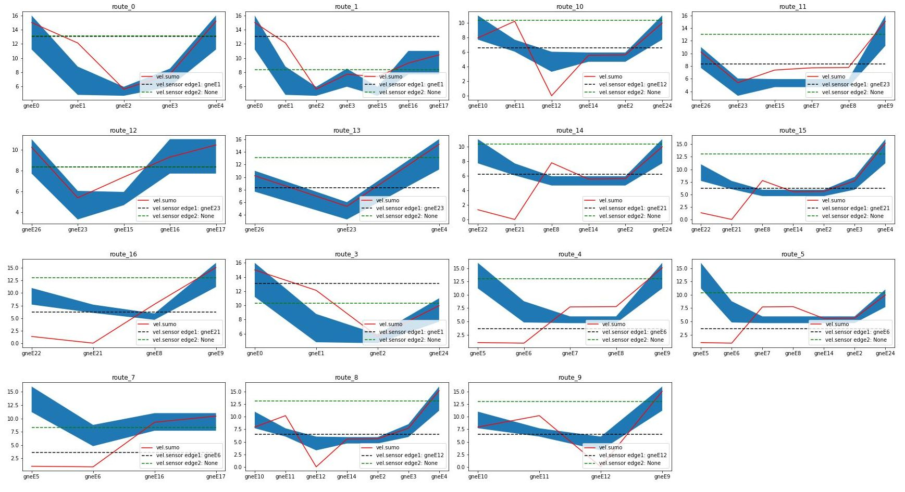
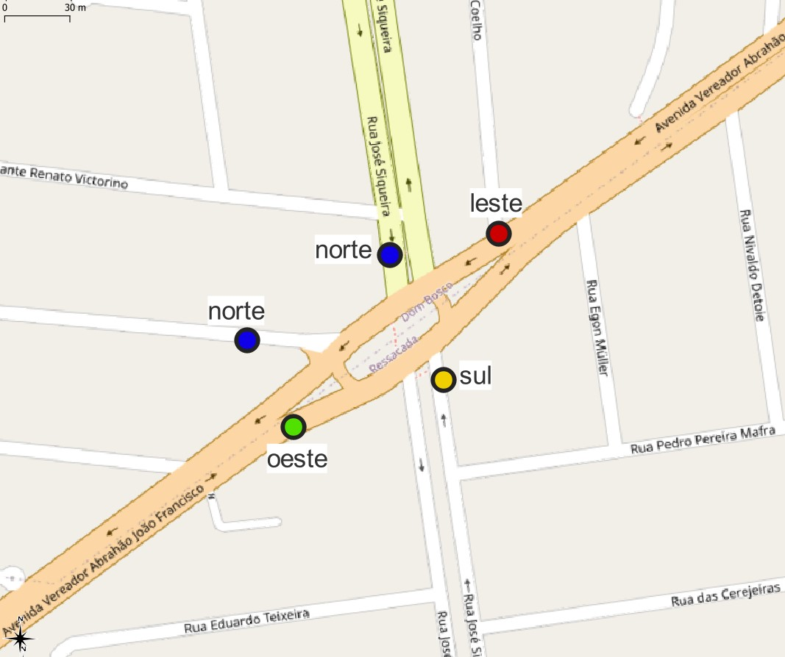

# Estimação de fluxos veiculares utilizando dados de navegação móvel e simuladores de tráfego.

**Jaceguay Zukoski**

2019/II (1401) Curso de Especialização em Big Data – Turma II

Campus Itajaí Rua Uruguai, 458 - Centro/ Itajaí - SC CEP: 88302-901

Universidade do Vale de Itajaí (UNIVALI) – Itajaí, SC – Brasil

**Resumo** - O presente artigo detalha a pesquisa exploratória voltada ao problema da ausência de contagens de veículos para o planejamento urbano, a hipótese prevê a utilização do SUMO um simulador microscópico de trânsito, para obter características do fluxo de veículos a partir de informações disponibilizadas abertamente em serviços de navegação veicular, especificamente o Google Maps traffic. Foi selecionada uma interseção viária complexa, compreendendo uma rótula entre vias de várias classes. Pela natureza das informações disponibilizadas pelo Google Traffic seu nível de detalhe aumenta quanto maior o número de conflitos ou congestionamentos, desta maneira o horário selecionado foi o pico da tarde, das 18:00 horas até as 19:00 horas. O objetivo é que se tenha uma estimativa do número de veículos, para serem utilizados como variáveis de entrada em outros cenários de simulação no próprio SUMO.

Palavras chave - Mapa de tráfego, Simulador SUMO, Google Traffic, contagem de tráfego.

**Abstract** - This article details the exploratory research, focused on the problem of the absence of vehicle counts for urban planning, the hypothesis foresees the use of SUMO, a microscopic traffic simulator, to obtain the flow of vehicles from information openly available in mobile device navigation apps, specifically Google Maps traffic. For the simulations a complex road intersection was selected, comprising a roundabout between roads of various classes. Due to the nature of the information provided by Google Traffic, its level of detail relate directly to the amount of traffic jams and irregularities in the current view, the selected time was the peak of the afternoon, from 6:00 pm to 7:00 pm. The objective is to have an estimate of the number of vehicles, so that it can be used as input variables in other simulation scenarios in SUMO itself.

Keywords - Traffic Map, SUMO Simulator, Google Traffic, Traffic Count.

## 1. Introdução

O crescimento acelerado das cidades, principalmente a partir da década de 1970, resultou no aumento da frota de veículos, principalmente individuais motorizados.

Tabela 1: Evolução na Frota de Veículos dos municípios do entorno da BR 101/SC - 2010 e 2019.

Variável          | 2010       | 2019        | % de Crescimento | Estimativa para 2029
------------------|------------|-------------|------------------|---------------------
Frota de veículos | 1.7 milhão | 2.6 milhões | 52,9%            | 4.5 milhões

Fonte: Denatran - Elaboração e compilação FIESC/GETMS

A demanda acelerada por mobilidade e subsequentemente pressão na infra estrutura viária se manifesta com congestionamentos e decaimento no nível de serviços de vias, ao mesmo tempo eleva o consumo de combustíveis e os níveis de poluição. Enquanto se por um lado o setor público tem investido na análise das redes viárias, a fim de predizer e tratar os fatores determinantes geradores de conflitos, várias iniciativas privadas buscam desenvolver serviços com a intenção de auxiliar o grande número de pessoas atingidas. O modelo adotado é o colaborativo, onde cada usuário reporta em tempo real sua situação para a rede. Outra característica a fim de garantir a adequação às leis de proteção de dados e o anonimato de seus usuários, é a de que os dados são em grande parte qualitativos, limitando-se a exibir apenas as condições de tráfego sem detalhes sobre as quantidades, por tipos de veículos ou condutores.

Apesar de apresentar apenas uma fração, no que diz respeito às informações necessárias para o planejamento pelo poder público, onde a contagem do fluxo de veículos é um dos insumos primários de qualquer análise do sistema viário, os aplicativos compensam oferecendo menor custo com maior disponibilidade e abrangência, tanto temporal quanto espacial.

As provas realizadas buscam reunir as características do tráfego reportadas pelos aplicativos e a modelagem da malha viária com regulamentação do trânsito, para preencher parâmetros desconhecidos, neste caso o número de veículos, através da simulação utilizando-se do SUMO.

## 2. Conceitos básicos

### "Simulation of Urban MObility" (SUMO)

A simulação de sistema de transporte como ferramenta de análise tem a habilidade de emular a variação do tempo sobre a enorme quantidade de variáveis que surgem ao redor do trânsito, é utilizada para predizer o resultado de um sistema real. Dentre os modelos destacam-se:

- Macroscópico: Onde o fluxo (densidade, volume e velocidade) são caracterizados e utilizam-se cálculos como na dinâmica computacional de fluídos. Este modelo aborda o problema de fluxo de tráfego em um nível baixo de detalhes, não existindo interesse por cada unidade individual e sim no processo como um todo.

- Microscópico: É apropriado para estudos com elevado nível de detalhamento, baseado na descrição do movimento de cada veículo individualmente, cada um com propriedades como troca de faixa, aceleração entre outras. A abordagem mais evidente é a car-following, em que o veículo reage ao veículo imediatamente anterior a ele no fluxo de tráfego.

O SUMO é um simulador Microscópico, o que significa que sua implementação é síncrona, a cada passo da simulação (por padrão um segundo) o estado de todas as entidades do modelo são atualizadas, a rotina pode ser descrita da seguinte maneira:

a. Inicialização: Calcula o menor caminho, a partir da origem para o destino pré definido.

b. Inserção de veículos: Repete até que seja inserida toda a demanda de tráfego:

   1. Determina o próximo movimento de cada entidade.

   2. Aplica os modelos de troca de faixa, car-following, etc.

   3. Aplica a posição final resultante.

c. Resultado: Coleta e apresenta o conjunto de informações a respeito da simulação.

Os arquivos de entrada mínimos necessários no padrão XML são os seguintes:

- simulacao.sumocfg: Responsável por indicar o nome dos outros arquivos de entrada e saída da simulação.

- malha.net.xml: Linhas (edges) e vértices (nodes) na forma de um grafo que representa o desenho da malha viária. Também armazena as regras de conversões em cruzamentos e velocidades máximas de cada via e faixas. O módulo Netedit (interface gráfica para desenho da malha) e NetConvert podem ser utilizados.

- demanda.rou.xml: Em resumo contêm a maneira, momento, e quantidade de veículos que irão entrar na malha viária, pode conter uma rota pré definida ou apenas um ponto de origem e destino.

Outros arquivos como um adicional também podem ser incluídos, definindo elementos como sensores e câmeras para contagem em pontos específicos, por exemplo.

Os arquivos de saída com os resultados da simulação podem ser solicitados em vários níveis de detalhe, a partir da linha de comando ao se chamar a simulação como argumento ou dentro do arquivo sumocfg. Os valores podem conter os dados completos (--full-output), com a posição e estado dos veículos a cada passo da simulação, por trecho do sistema viário, rota ou fluxo, medições agregadas, tempos de espera, atrasos, consumo de combustível, etc.

### Google Maps Traffic

Nos últimos anos a difusão do uso de aplicativos de mapeamento e acesso a celulares com GPS, apresentou uma oportunidade inédita ao que antes tratava apenas de orientação e roteamento aos usuários. Serviços como Apple Maps, Waze, Nokia, HERE maps e Mapquest, contam com informações complementares sobre problemas no trânsito, utilizando como fontes a própria contribuição anônima dos usuários do sistema. Dentre estes o Google se destaca desde a compra do Waze em 2013, principalmente pelo grande número de usuários e por consequência maior número de contribuições para sua base de informações.

O acesso ao serviço se dá através de dispositivos móveis ou pelo endereço http://maps.google.com, em sua interface o usuário pode navegar até a área de interesse e alternar entre a visualização com temas como satélite, transporte público e por fim o trânsito. Neste existem duas leituras, a padrão é a "Trânsito em tempo real" e que pode ser alterada para  "Trânsito típico", baseado no histórico da área.

Os trechos com irregularidades possuem duas propriedades, o comprimento e cor atribuída ao nível de atraso. O atraso representado por cada cor é relativo à velocidade da via.

- verde: 70% a 100%
- laranja: 55% a 70%
- vermelho: 30% a 55%
- vermelho escuro: 0% a 30%

## 3. Metodologia

### Captura de dados

Os dados de trânsito foram capturados no dia 27/08/2021, a partir da opção "Trânsito em tempo real" às 18:39 horas no endereço do serviço.


Figura 1: Captura de tela do endereço http://maps.google.com

Para facilitar os trabalhos seguintes de digitalização da malha, foi feito o georreferenciamento da imagem no software QGIS utilizando o sistema de referência de coordenadas SIRGAS 2000/UTM zone 22s.

### Configuração do SUMO

**- Malha viária (.net.xml):** Pode ser obtida de várias maneiras como a partir de malhas externas, através do módulo NETCONVERT pode utilizar dados provenientes de arquivos .shp ou até mesmo de serviços online como OpenStreetMap. Se optou por confeccionar uma malha própria utilizando outro módulo dedicado o NETEDIT, com o intuito de mapear com a maior exatidão possível (menor escala gráfica) o modelo, o NETEDIT também permite que sejam acrescidas propriedades adicionais personalizadas, além das características físicas e de regulamentação de trânsito.

A imagem capturada e georreferenciada pôde ser inserida no projeto como fundo (background/decal), por se tratar de uma arquivo GeoTIFF (georreferenciado), este irá assumir as dimensões em metros e localização corretas no NETEDIT. O processo de digitalização consiste na criação de nós e linhas de um grafo. Os nós assumem as propriedades das interseções viárias, com as regras de conversões permitidas e proibidas para cada faixa e as linhas assumem as características das vias,  com número de faixas, prioridade e velocidades permitidas, foram inseridas ainda propriedades adicionais, além da velocidade máxima regulamentada em cada via as cores apresentadas pelo Google Traffic foram convertidas em velocidade (metros por segundo) e acrescentadas a cada trecho utilizando o campo 'parameters'.

Tabela 2: Intervalo de velocidade nas áreas de conflito, cores Google Maps Traffic

nome                          | km/h | m/s | verde m/s   | laranja m/s   | vermelho m/s | vermelho escuro m/s
------------------------------|------|-----|-------------|---------------|--------------|--------------------
Av.Ver.Abrahão João Francisco | 60   | 16  | 11.2 até 16 | 8.8 até 11.19 | 4.8 até 8.79 | 0 até 4.79
R.Estud.Renato Victorino      | 40   | 11  | 7.7 até 11  | 6.05 até 7.69 | 3.3 até 6.04 | 0 até 3.29
R.José Siqueira               | 40   | 11  | 7.7 até 11  | 6.05 até 7.69 | 3.3 até 6.04 | 0 até 3.29
R.Pres.João Goulart           | 40   | 11  | 7.7 até 11  | 6.05 até 7.69 | 3.3 até 6.04 | 0 até 3.29


Figura 2: Módulo Netedit, sobreposição da malha digitalizada pelo autor com a imagem georreferenciada proveniente de captura de tela do Google Maps/Tráfego.

**- Atribuição de demanda e rotas (demanda.rou.xml):** A escolha do método de atribuição de tráfego depende da pesquisa conduzida, o mínimo exigido consiste de uma lista de veículos, o tempo de entrada na simulação, um ponto de origem e outro de destino, no caso de um único veículo esta descrição se chama trip (viagem), já para grupos de veículos estes são definidos como flow (fluxo), com estas atribuições mínimas a rota ótima é calculada durante a simulação pelo próprio SUMO. Neste estudo as rotas foram determinadas de maneira arbitrária reproduzindo os movimentos e conversões encontrados na interseção, agrupados pela orientação de acesso que mais tarde se tornarão os pontos de interesse de contagem de veículos. Abaixo a forma que o padrão XML descreve o conjunto sucessivo de edges para formar duas rotas, já na sequência dois fluxos (veículos por hora) são atribuídos a cada uma destas rotas, ao fim o atributo 'number' se refere ao número de veículos que este fluxo irá alocar a simulação, configurada para duração de uma hora.

```xml
<route edges="gneE0 gneE1 gneE2 gneE3 gneE4" color="yellow" id="route_0" />
<route edges="gneE0 gneE1 gneE2 gneE3 gneE15 gneE16 gneE17" color="yellow" id="route_1" />
```
...
```xml
<flow id="flow_0" type="veic_pass" begin="0.00" departSpeed="8.00" route="route_0" end="3600.00" number="10" />
<flow id="flow_1" type="veic_pass" begin="0.00" departSpeed="8.00" route="route_1" end="3600.00" number="10" />
```


Figura 3: Rotas definidas que devem receber os fluxos de veículos.

**- Sensores (adicionais.xml):** Um arquivo adicional com a descrição de sensores que podem ser posicionados na malha como câmeras, indução dentre outros. Em contrapartida aos resultados que o sumo apresenta ao fim da simulação, estes têm a vantagem de coletarem dados de maneiras e pontos específicos. Os sensores utilizados foram de indução (Induction Loops Detectors - E1), um sensor simples que mede as propriedades dos veículos à medida que passam sobre ele. Abaixo a descrição de um sensor atribuído a uma faixa, seguido pelo caminho do arquivo em que os resultados serão gravados.

```xml
<e1Detector id="e1Detector_gneE12_0_6" lane="gneE12_0" pos="8.00" freq="300.00" file="resultados/detectores/e1_cliclo_1.xml" />
```

### Relatórios

A simulação foi configurada com a duração de uma hora, avançando com um passo a cada segundo. Os resultados são armazenados no padrão XML, foram utilizados dois arquivos de saída de dados:

**- "full-output":** O arquivo ```full.output.xml```, contém informações sobre todas as linhas e veículos a cada passo da simulação, dentre os vários valores coletados destacam-se os seguintes:

valor         | descrição
--------------|----------------------------------------------------------------
vehicle_route | rota a qual o veículo foi atribuído
vehicle_edge  | faixa a qual o veículo está alocado no passo atual da simulação
vehicle_speed | velocidade do veículo no passo atual da simulação

Deste ponto em diante, se torna necessária a manipulação e preparo dos dados, para tanto foi utilizada a linguagem python em conjunto com a biblioteca Pandas, foram obtidas as velocidade médias para cada trecho em cada rota da malha.

```python
veic_sumo = veics_sumo.groupby(['vehicle_route', 'vehicle_edge'],
                                as_index=False)['vehicle_speed'].median()
```

Tabela 3: Amostra da tabela contendo as médias de velocidades que os fluxos desenvolveram ao longo das rotas:

vehicle_route | vehicle_edge | vehicle_speed
--------------|--------------|--------------
route_0       | gneE0        | 15.00
route_0       | gneE1        | 12.12
route_0       | gneE2        | 5.61

**- "adicionais.xml":** A partir do arquivo ```adicionais.xml``` os detectores foram posicionados em torno da interseção viária, de maneira a capturarem todos os veículos que adentram e saem da interseção viária.


Figura 4: Posicionamento dos detectores na malha.

Tabela 4: Descrição dos dados obtidos pelos arquivos de saída

atributo    | descrição
------------|----------------------------------------------------------------------------------------------
id          | nome do trecho (edge) em que o sensor está instalado
speed       | velocidade média dos veículos que cruzaram o sensor (m/s)
nVehEntered | número de veículos
name        | nome da via em que o sensor está instalado
priority    | via que tem o fluxo preferencial, quanto maior o número maior a prioridade
lenght      | comprimento do trecho (m)
vmax        | velocidade máxima no trecho, obtida a partir da codificação por cores do Google traffic (m/s)
vmin        | velocidade mínima no trecho, obtida a partir da codificação por cores do Google traffic (m/s)

A obteção da tabela com os valores agregados foi feita a partir da seguinte expressão:

```python
detectores_gb = detectores.groupby(['id']).agg({'speed':'mean', 'nVehEntered':'sum'}).reset_index()

detectores_malha = pd.merge(
    detectores_gb, malha, how='left', on=['id']).reset_index()
```

Tabela 5: Amostra de valores obtidos a partir da união do arquivo de saída dos detectores com as propriedades da malha

id     | speed     | nVehEntered | name                          | priority | length | vmax  | vmin
-------|-----------|-------------|-------------------------------|----------|--------|-------|-----
gneE1  | 13.064333 | 981         | Av.Ver.Abrahão João Francisco | 3        | 84.08  | 8.79  | 4.80
gneE12 | 6.538000  | 30          | R.Pres.João Goulart           | 1        | 103.05 | 6.04  | 3.30
gneE16 | 8.326000  | 1008        | R.José Siqueira               | 3        | 33.21  | 11.00 | 7.70
gneE21 | 6.234667  | 519         | R.José Siqueira               | 3        | 94.32  | 7.69  | 6.05

### Resultados preliminares

A configuração inicial conta com o modelo da malha viária completo com as regras de comportamento permitidas, já na atribuição de demanda foi utilizado um arquivo com um valor de 10 veículos alocados por fluxo/rota. O comportamento não corresponde ao observado no Google Traffic, uma vez que não são conhecidas as demandas que levaram a este, os gráficos abaixo demonstram esta disparidade:


Figura 5: Desempenho da velocidade média de cada fluxo/rota (linha vermelha) em relação a velocidade máxima e mínima esperadas segundo o Google Traffic (região azul).

## 4. Experimento

Para que o comportamento dos veículos se aproxime com a situação reportada, onde o nível de ocupação das vias gera um impacto na velocidade média dos fluxos, serão adicionados mais veículos a simulação. O processo de adição de veículos irá seguir a seguinte ordem:



A implementação de um processo com sucessivas simulações tem o intuito de aumentar de maneira gradativa a pressão no sistema, até o ponto onde a velocidade média de todos os fluxos se aproxime da situação apresentada pelo aplicativo de navegação, esta estratégia foi selecionada no lugar de um modelo de previsão pela facilidade em utilizar a simulação, apesar da complexidade do cenário considerado e suas particularidades, tanto a respeito da geometria viária, sua descrição funcional e interação dos vários fluxos com a malha e entre si, o modelo baseado em simulação se mostra capaz de incorporar estes aspectos de maneira simples ao usuário.

Em cada ciclo envolvendo simulação e avaliação dos resultados, são realizadas considerações a respeito de quais fluxos devem receber veículos adicionais primeiro, qual o número de veículos serão adicionados para a próxima simulação ou se o resultado já está próximo o suficiente do esperado, que implica na finalização do processo. A utilização da prioridade da via no processo significa que as vias de prioridades menores só receberão veículos após as de maior prioridade, as vias que possuem preferência nas interseções viárias geram uma dependência no fluxo das vias secundárias e terciárias.

A definição do número de veículos a serem adicionados é decidida combinando a diferença entre a velocidade média esperada da obtida no ciclo atual, multiplicando o comprimento esperado de atraso no trecho (propriedade length). A seguinte expressão foi utilizada para se obter o índice de crescimento, a granularidade pode ser definida pela divisão do resultado obtido, neste caso adotou-se 10:

Tabela 6: Variáveis utilizadas no processo de avaliação dos resultados para criação dos parâmetros para próxima simulação no fluxo

variável           | descrição
-------------------|------------------------------------------------------------------------------------
demanda_anterior   | número de veículos alocados na última simulação, por rota
sumo_sensor_speed  | velocidade média capturada pelo sensor, relativo a cada rota
vmax_sensor        | velocidade máxima segundo o Google Traffic, no trecho onde está localizado o sensor
snesor_edge_lenght | comprimento do trecho, que possue a cor atribuída pelo Google Traffic

```python
np.ceil((demanda_anterior + ((abs(valor['sumo_sensor_speed'] - valor['vmax_sensor'])) * valor['sensor_edge_length'])/10)
```

## 5. Resultados

Os valores são obtidos ao fim do último ciclo, onde todas as velocidades máximas remanescentes se encontravam abaixo da prevista pelo mapa do Google Traffic. Para realização da contagem de veículos que adentram o cruzamento, quatro grupos foram criados a partir das 15 rotas, provenientes da previsão dos movimentos previstos no SUMO.

Tabela 7: Grupo de rotas por direção de entrada no cruzamento

grupo | rotas
------|---------------------------------------------------------
oeste | route_0, route_1, route_3
norte | route_8, route_9, route_10, route_14, route_15, route_16
leste | route_4, route_5, route_7
sul   | route_11, route_12, route_13


Figura 6: Visão geral do processo de adição de veículos ao longo do ciclo de simulações.



Figura 7: Desempenho da velocidade média de cada fluxo/rota (linha vermelha) após 30 ciclos, relação com a velocidade máxima e mínima esperadas segundo o Google Traffic (região azul).

Como a cada passo um novo arquivo 'demanda.rou.xml' é criado para utilização no próximo ciclo, a avaliação da demanda final de veículos atribuídos foram capturados do último arquivo criado.

Tabela 8: Número total de veículos em uma hora, contado ao fim do 30° ciclo

grupo | veículos alocados
------|------------------
oeste | 981
norte | 549
leste | 1344
sul   | 660

### Comparação com contagem de veículos

Para a avaliação os resultados foram comparados com uma contagem feita no local. A contagem tem data de 17/03/2021, considerando o mesmo período utilizado na simulação das 18:00 horas até as 19:00 horas.



Figura 7: Pontos selecionados para contagem.

Tabela 9: Valores do resultado a partir da simulação e da contagem realizada

grupo | veículos alocados | veículos contagem in loco
------|-------------------|--------------------------
oeste | 981               | 1127
norte | 549               | 600
leste | 1344              | 1391
sul   | 660               | 709

## 6. Conclusão

O objetivo deste artigo foi a avaliação da viabilidade de utilização de um ambiente simulado na determinação de valores desconhecidos, para se obter o número de veículos que adentram uma interseção viária, utilizou-se a modelagem do ambiente simulado em conjunto com dados de aplicativos de navegação móvel. A estratégia adotada foi o aumento gradual de veículos inseridos na simulação, com o intuito de reproduzir as condições o mais próximas possíveis que levaram a velocidade média reportada pelo serviço de navegação. O ciclo de aproximação é composto de uma fase de simulação e outra de avaliação de resultados, para que seja feita a definição dos valores da próxima simulação ou finalização do processo.

A partir da comparação da análise dos valores obtidos no cenário simulado e dados recolhidos no local, pode-se concluir que o número total de veículos estimados se encontra próximo do observado. Outro ponto importante são as proporções obtidas também serem semelhantes, demonstrando o peso das características do congestionamento coletadas no Google Traffic (velocidade média e comprimento do trecho com atraso).

## 7. Próximos passos

Apesar dos resultados expressos neste artigo o SUMO por se tratar de um simulador de tráfego microscópico permite um grande número de variáveis, desde o comportamento individual de cada veículo por tipo e condutor, é imprescindível que sejam aprofundados os estudos utilizando-se estas capacidades. A pesquisa abordou uma modelagem detalhada das condições da via, contudo considerando a infinidade de situações encontradas em toda a extensão do sistema viário, este estudo deve ser considerado como uma primeira etapa de uma investigação mais abrangente.

## 8. Referências

- GOOGLE MAPS, 2021. Av. Ver. Abrahão João Francisco - Centro Itajaí - SC, 1:1.500. Google Maps [online]. Disponível:  Google Maps <https://www.google.com.br/maps/@-26.9359751,-48.6964524,16.77z>, acesso em: 27 de ago. de 2021;

- SUMO WIKI. Simulação do Urban Mobility – Wiki. Disponível em <https://sumo.dlr.de/wiki/Simulation_of_Urban_MObility_-_Wiki>, acesso em: 01 de ago. de 2021;

- DNIT. Manual de estudos de tráfego. Rio de Janeiro, 2006. 384 p. IPR-723;

- CONTRAN. Volume IV – Sinalização Horizontal. Manual Brasileiro de Sinalização de Trânsito, 2007;

- FEDERAÇÃO DAS INDÚSTRIAS DO ESTADO DE SANTA CATARINA. BR101 do futuro: proposta para garantir a segurança e a eficiência do eixo litorâneo catarinense. Florianópolis, 2020;

- DE PAULA, Marilene; BARTELT, Dawid Danilo. Mobilidade urbana no Brasil: desafios e alternativas. Rio de Janeiro: Fundação Heinrich Böll, 2016;

- MATPLOTLIB. Matplotlib: Visualization with Python. Disponível em: <https://matplotlib.org/index.html >, acesso em: 03 set. 2021.