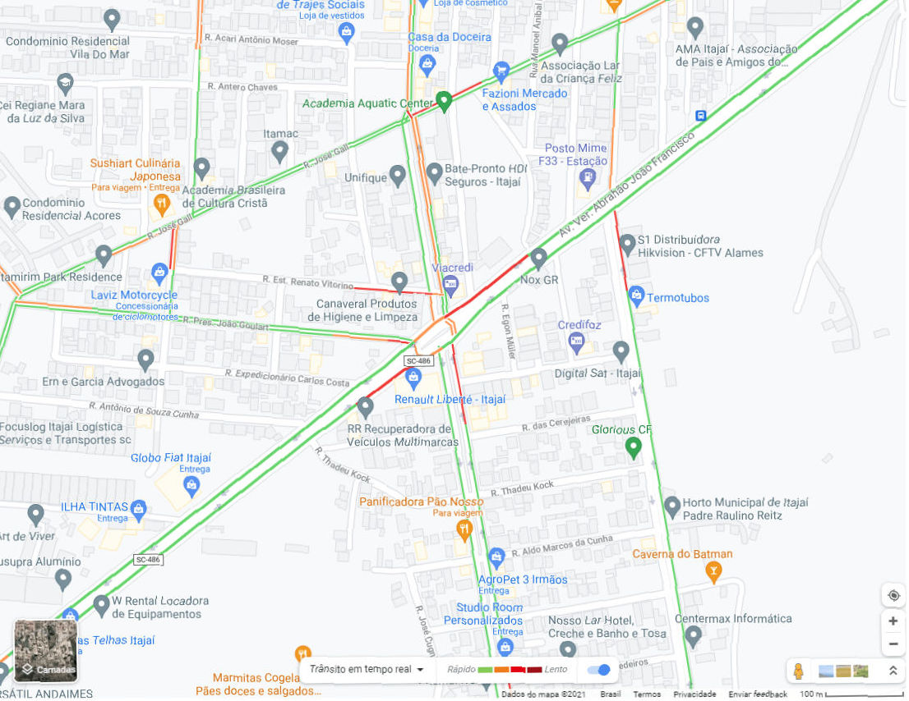
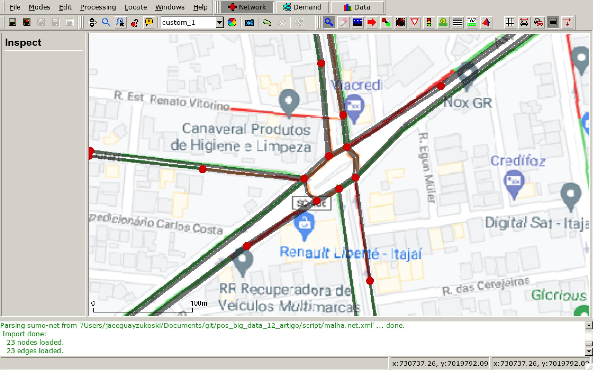
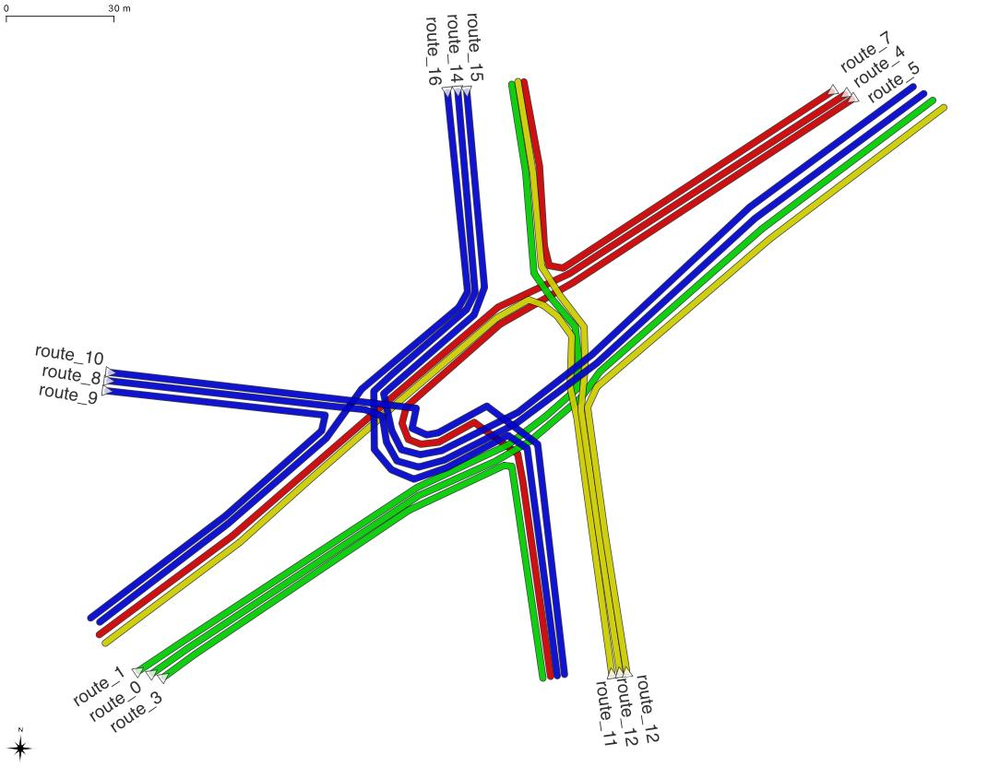
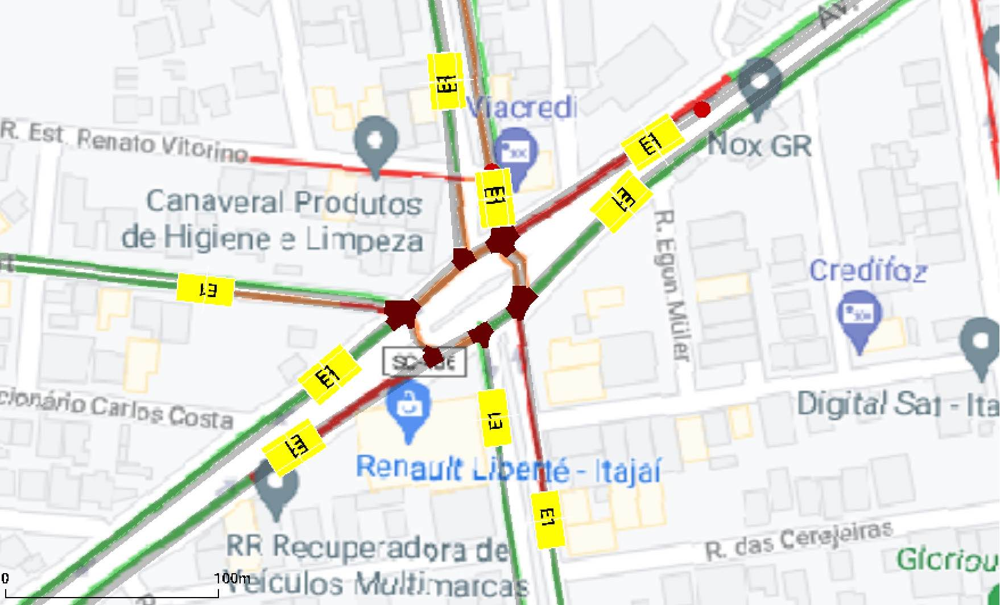
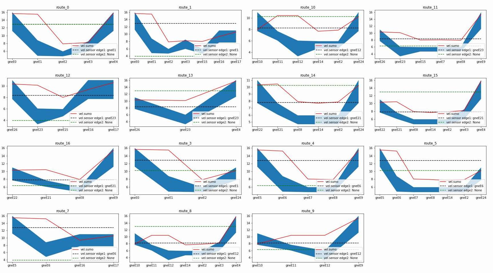

Resumo - O presente artigo detalha os testes utilizando o SUMO, um simulador microscópico de trânsito, para obter características do fluxo de veículos a partir de informações disponibilizadas abertamente em serviços de navegação veicular, especificamente o Google Maps traffic. Para as simulações foi selecionada uma interseção viária complexa, compreendendo uma rótula entre vias de várias classes. Pela natureza das informações disponibilizadas pelo Google Traffic, o nível de detalhe apresentado é maior quanto ao número de conflitos ou congestionamentos, desta maneira o horário selecionado foi o pico da tarde, das 18:00 horas até as 19:00 horas. O objetivo é que se tenha uma estimativa do número de veículos, para que se possa utilizar como variáveis de entrada em outros cenários de simulação no próprio SUMO.

Palavras chave - Mapa de tráfego, Simulador SUMO, Google Traffic, contagem de tráfego.

## 1. Introdução

O crescimento acelerado das cidades, principalmente a partir da década de 1970, resultou no aumento da frota de veículos, principalmente dos individuais motorizados.

Evolução na Frota de Veículos dos municípios do entorno da BR 101/SC - 2010 e 2019

Variável          | 2010       | 2019        | % de Crescimento | Estimativa para 2029
------------------|------------|-------------|------------------|---------------------
Frota de veículos | 1.7 milhão | 2.6 milhões | 52,9%            | 4.5 milhões
Fonte: Denatran - Elaboração e compilação FIESC/GETMS

A demanda acelerada por mobilidade e subsequentemente pressão na infra estrutura viária, se manifesta com congestionamentos e decaimento no nível de serviços de vias. Ao mesmo tempo eleva o consumo de combustíveis e os níveis de poluição. Enquanto se por um lado setor público tem investido na análise das redes viárias, a fim de predizer e tratar os fatores determinantes geradores de conflitos, várias iniciativas privadas buscam desenvolver serviços, com a intenção de auxiliar o grande número de pessoas atingidas. O modelo adotado é o colaborativo, onde cada usuário reporta em tempo real sua situação para a rede. Outra característica, a fim de garantir a adequação às leis de proteção de dados e o anonimato de seus usuários, é a de que os dados são em grande parte qualitativos, limitando-se a exibir apenas as condições de tráfego, sem detalhes sobre as quantidades, por tipos de veículos ou condutores.

Apesar de apresentar apenas uma fração, no que diz respeito às informações necessárias para o planejamento pelo poder público, onde a contagem do fluxo de veículos é um dos insumos primários de qualquer análise do sistema viário, os aplicativos compensam oferecendo disponibilidade e abrangência tanto temporal quanto espacial.

As provas realizadas buscam reunir as características do tráfego, reportadas pelos aplicativos, as características físicas da malha viária e regulamentação de trânsito, para preencher parâmetros desconhecidos, neste caso o número de veículos, através da simulação utilizando-se do SUMO.

## 2. Conceitos básicos

### "Simulation of Urban MObility" (SUMO)
A simulação de sistema de transporte como ferramenta de análise, tem a habilidade de emular a variação do tempo sobre a enorme quantidade de variáveis que surgem ao redor do trânsito, é utilizada para predizer o resultado de um sistema real. Dentre os modelos destacam-se:

- Macroscópico, onde o fluxo macroscópico (densidade, volume e velocidade) são caracterizados e utilizam-se cálculos como na dinâmica computacional de fluídos. Este modelo aborda o problema de fluxo de tráfego em um nível baixo de detalhes, não existindo interesse por cada unidade individual, e sim no processo como um todo.

- Microscópico, é apropriado para estudos com elevado nível de detalhamento, baseado na descrição do movimento de cada veículo individualmente, cada um com propriedades como troca de faixa, aceleração entre outras. A abordagem mais evidente é a car-following, em que o veículo reage ao veículo imediatamente anterior a ele no fluxo de tráfego.

O SUMO é um simulador Microscópico, o que significa que sua implementação é síncrona, a cada passo da simulação (por padrão um segundo) o estado de todas as entidades do modelo são atualizadas, a rotina pode ser descrita da seguinte maneira:

a. Inicialização: Calcula o menor caminho, a partir da origem para o destino pré definido.

b. Inserção de veículos: Repete até que seja inserida toda a demanda de tráfego:

   1. Determina o próximo movimento de cada entidade.

   2. Aplica os modelos de troca de faixa, car-following, etc.

   3. Aplica a posição final resultante.

c. Resultado: Coleta e apresenta o conjunto de informações a respeito da simulação.

Os arquivos de entrada mínimos necessários, todos XML, são os seguintes:

- simulacao.sumocfg: Responsável por indicar o nome dos outros arquivos de entrada e saída da simulação.

- malha.net.xml: Linhas (edges) e vértices (nodes), na forma de um grafo que representa o desenho da malha viária. Também armazena as regras de conversões em cruzamentos e velocidades máximas de cada via e faixas. O módulo Netedit (interface gráfica para desenho da malha) e NetConvert podem ser utilizados.

- demanda.rou.xml: Em resumo contêm a maneira, momento, e quantidade de elementos que irão entrar na malha viária, pode conter uma rota pré definida ou apenas um ponto de origem e destino.

Outros arquivos como um adicional também podem ser incluídos, definindo elementos como sensores e câmeras para contagem em pontos específicos, por exemplo.

Os arquivos de saída com os resultados da simulação podem ser solicitados em vários níveis de detalhe, a partir da linha de comando ao se chamar a simulação, como argumento ou dentro do arquivo sumocfg. Os valores podem ser dentre vários disponíveis, os dados completos (--full-output) com a posição e estado dos veículos a cada passo da simulação por trecho do sistema viário, as medições agregadas pela velocidade em cada trecho, tempos de espera, atrasos, consumo de combustível, etc.

### Google Maps Traffic

O a difusão do uso de aplicativos de mapeamento e acesso a celulares com GPS, apresentou uma oportunidade inédita ao que antes tratava apenas de orientação e roteamento. Apple Maps, Waze, Nokia, HERE maps e Mapquest, contam com informações complementares sobre o tráfego, utilizando como fontes a própria contribuição anônima dos usuários do sistema. Dentre estes o Google se destaca desde a compra do Waze em 2013, pelo grande número de usuários e por consequência contribuições para seu serviço.

O acesso ao serviço se dá através de dispositivos móveis ou pelo endereço http://maps.google.com, em sua interface o usuário pode navegar até a área de interesse e alternar entre a visualização de temas como satélite, transporte público e por fim o trânsito. Neste existem duas leituras, a padrão é a "Trânsito em tempo real" que pode ser alterada para ̃Trânsito típico", baseado no histórico da área.

Os trechos com irregularidades possuem duas propriedades, o comprimento e cor atribuída ao nível de atraso. O atraso é relativo à velocidade da via.

- verde: 70% a 100%
- laranja: 55% a 70%
- vermelho: 30% a 55%
- vermelho escuro: 0% a 30%

## 3. Metodologia

### Captura de dados

Os dados de trânsito foram capturados no dia 27/08/2021, a partir da opção "Trânsito em tempo" real as 18:39 horas, no endereço do serviço.


Figura 3.1: Captura de tela do endereço http://maps.google.com

Para facilitar os trabalhos seguintes de digitalização da malha, foi feito o georreferenciamento da imagem no software QGIS, no sistema de referência de coordenadas SIRGAS 2000/UTM zone 22s.

### Configuração do SUMO

**A malha viária (.net.xml):** Pode ser obtida de várias maneiras, como a importação pode malhas externas, que incluem a conversão através do módulo NETCONVERT, provenientes de arquivos .shp ou até mesmo o OpenStreetMap. Se optou por confecionar uma malha própria utilizando o módulo Netedit, de maneira a refletir com maior exatidão possível no modelo, as características físicas e da regulamentação de trânsito.

A imagem capturada e georreferenciada pode ser inserida no projeto como fundo (background/decal), por se tratar de uma arquivo GeoTIFF, a partir do tratamento da captura no QGIS, este irá assumir as dimensões em metros e localização corretas no Netedit. O processo de digitalização consiste na criação dos nós e linhas de um grafo. Os nós assumem as propriedades das interseções viárias, com as regras de conversões permitidas e proibidas para cada faixa. As linhas assumem as características da via como número de faixas e prioridade, foram inseridas ainda propriedades adicionais, além da velocidade máxima regulamentada em cada via, baseando-se nos dados apresentados pelo Google Traffic como influência na velocidade da via pelo atraso nos trechos coloridos:

Intervalo de velocidade nas áreas de conflito, cores Google Maps Traffic:

nome                          | km/h | m/s | verde m/s   | laranja m/s   | vermelho m/s | vermelho escuro m/s
------------------------------|------|-----|-------------|---------------|--------------|--------------------
Av.Ver.Abrahão João Francisco | 60   | 16  | 11.2 até 16 | 8.8 até 11.19 | 4.8 até 8.79 | 0 até 4.79
R.Estud.Renato Victorino      | 40   | 11  | 7.7 até 11  | 6.05 até 7.69 | 3.3 até 6.04 | 0 até 3.29
R.José Siqueira               | 40   | 11  | 7.7 até 11  | 6.05 até 7.69 | 3.3 até 6.04 | 0 até 3.29
R.Pres.João Goulart           | 40   | 11  | 7.7 até 11  | 6.05 até 7.69 | 3.3 até 6.04 | 0 até 3.29


Figura 3.2: Módulo Netedit, sobreposição da a malha digitalizada pelo autor com a imagem georreferenciada proveniente de captura de tela do Google Maps/Tráfego.

**Atribuição de demanda e rotas (demanda.rou.xml):** A escolha do método de atribuição de tráfego depende da pesquisa conduzida. No mínimo é exigido uma lista de veículos com um tempo de entrada na simulação seguido de um ponto de origem e outro de destino, chamado de trip (viagem) para cada veículo ou flow (fluxo) para grupos de veículos, em ambos os casos a rota ótima é calculada durante a simulação. De maneira a ter controle sobre o fluxo de veículos, foi adotada outra modalidade onde o fluxo, com um número específico de veículos por hora, é atribuído a uma rota pré-definida.

```xml
<route edges="gneE0 gneE1 gneE2 gneE3 gneE4" color="yellow" id="route_0" />
<route edges="gneE0 gneE1 gneE2 gneE3 gneE15 gneE16 gneE17" color="yellow" id="route_1" />
```
...
```xml
<flow id="flow_0" type="veic_pass" begin="0.00" departSpeed="8.00" route="route_0" end="3600.00" number="10" />
<flow id="flow_1" type="veic_pass" begin="0.00" departSpeed="8.00" route="route_1" end="3600.00" number="10" />
```


Figura 3.3: Rotas definidas que devem receber os fluxos de veículos.

**Sensores (adicionais.xml):** Um arquivo adicional com a descrição de sensores por indução, câmeras dentre outros que podem ser inseridos na malha, em contrapartida aos resultados que o sumo apresenta ao fim da simulação, estes tem a vantagem de coletarem dados de maneiras e pontos específicos da malha. Os sensores utilizados foram de indução (Induction Loops Detectors - E1), um sensor simples que mede as propriedades dos veículos a medida que passam sobre ele.

```xml
<e1Detector id="e1Detector_gneE12_0_6" lane="gneE12_0" pos="8.00" freq="300.00" file="resultados/detectores/991605.xml" />
```

### Relatórios

A simulação foi configurada com a duração de uma hora, avançando com um passo a cada segundo. Os resultados são armazenados no padrão XML, foram selecionados e utilizados dois arquivos de saída de dados:

**- "full-output":** (```<full-output value="full.output.xml"/>```) definido no arquivo simulacao.sumocfg, contêm informações sobre todas as linhas e veículos a cada passo da simulação. Dentre os vários valores coletados destacam-se os seguintes que foram utiliados:

atributo      | descrição
--------------|----------------------------------------------------------------
vehicle_route | rota a qual o veículo foi atribuído
vehicle_edge  | faixa a qual o veículo está alocado no passo atual da simulação
vehicle_speed | velocidade do veículo no passo atual da simulação

Deste ponto em diante, se torna necessária a manipulação e preparo dos dados, para tanto foi utiliada a linguagem python em conjunto com a biblioteca Pandas, foram obtidas as velocidade médias para cada trecho em cada rota da malha.

```python
veic_sumo = veics_sumo.groupby(['vehicle_route', 'vehicle_edge'], as_index=False)[
    'vehicle_speed'].median()

veic_sumo.head(3)
```

vehicle_route | vehicle_edge | vehicle_speed
--------------|--------------|--------------
route_0       | gneE0        | 15.00
route_0       | gneE1        | 12.12
route_0       | gneE2        | 5.61

**- "adicionais.xml":** (```<additional-files value="adicionais.xml"/>```) Os detectores foram posicionados em torno da inteseção viária, de maneira a capturarem todos os veículos que entram ou saem utilizando as rotas pré definidas.


Figura 3.4: Posicionamento dos detectores na malha.

O arquivo de saída destacando-se as propriedades de interesse, foi tratado em conjunto com as informações da malha viária, a fim de fornecer as seguintes informações:

atributo    | descrição
------------|----------------------------------------------------------------------------------------------
id          | nome do trecho (edge) em que o sensor está instalado
speed       | velocidade média dos veículos que cruzaram o sensor (m/s)
nVehEntered | número de veículos
name        | nome da via em que o sensor está instalado
priority    | via que tem o fluxo preferêncial, quanto maior o número maior a prioridade
lenght      | comprimento do trecho (m)
vmax        | velocidade máxima no trecho, obtida a partir da codificação por cores do Google traffic (m/s)
vmin        | velocidade mínima no trecho, obtida a partir da codificação por cores do Google traffic (m/s)

```python
detectores_gb = detectores.groupby(['id']).agg({'speed':'mean', 'nVehEntered':'sum'}).reset_index()
detectores_malha = pd.merge(
    detectores_gb, malha, how='left', on=['id']).reset_index()
detectores_malha.head(3)
```

id     | speed     | nVehEntered | name                          | priority | length | vmax  | vmin
-------|-----------|-------------|-------------------------------|----------|--------|-------|-----
gneE1  | 13.064333 | 981         | Av.Ver.Abrahão João Francisco | 3        | 84.08  | 8.79  | 4.80
gneE12 | 6.538000  | 30          | R.Pres.João Goulart           | 1        | 103.05 | 6.04  | 3.30
gneE16 | 8.326000  | 1008        | R.José Siqueira               | 3        | 33.21  | 11.00 | 7.70
gneE21 | 6.234667  | 519         | R.José Siqueira               | 3        | 94.32  | 7.69  | 6.05

### Resultados preliminares

A configuração inicial conta com o modelo da malha viária completo com as regras de comportamento permitidas, já na atribuição de demanda foi utilizado um arquivo com um valor de 10 veículos alocados por fluxo/rota. O comportamento não corresponde ao observado no Google Traffic, uma vez que não são conhecidas as demandas que levaram a este, os gráficos abaixo demonstram esta disparidade:


Figura 3.5: Desempenho da velocidade média de cada fluxo/rota (linha vermelha) em relação a velocidade máxima e mínima esperadas segundo o Google Traffic (região azul).

## 4. Experimento


## 5. Resultados

### Comparação com contagem

## 6. Conclusão

## 7. Próximos passos

## Referências

