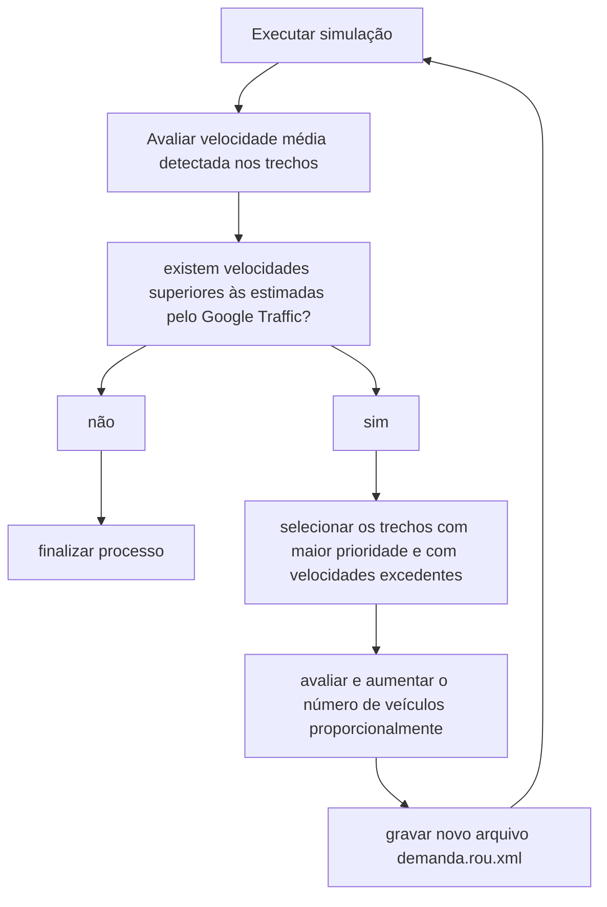

# R.José Siqueira x Av.Ver.Abrahão João Francisco

Adicionar rota, centro joão goulart e mesmo sentido peso velocidades trecho lombada

## Material base:

- captura google transit

27/08/2021 - 17:10

- verde: 70% a 100%
- laranja: 55% a 70%
- vermelho: 30% a 55%
- vermelho escuro: 0% a 30%

(70x8.5)/100 = 5.95

Base georreferenciada SIRGAS 2000/UTM zone 22S

coordenadas: 730656 x 7019845

## Objetivos

Obtenção da demanda: fluxo de veículos

## Etapas

1. Malha
2. Rotas (código trecho)
3. Sensores
4. Simulação

## 1. Malha

velocidade máxima:
nome                                         | km/h | m/s | verde m/s    | laranja m/s   | vermelho m/s  | vermelho escuro m/s
---------------------------------------------|------|-----|--------------|---------------|---------------|--------------------
Av.Ver.Abrahão João Francisco                | 60   | 16  | 11.2 até 16  | 8.8 até 11.19 | 4.8 até 8.79  | 0 até 4.79
Av.Ver.Abrahão João Francisco (próx.lombada) | 30   | 8.5 | 5.95 até 8.5 | 4.67 até 5.94 | 2.55 até 4.66 | 0 até 2.54
R.Estud.Renato Victorino                     | 40   | 11  | 7.7 até 11   | 6.05 até 7.69 | 3.3 até 6.04  | 0 até 3.29
R.José Siqueira                              | 40   | 11  | 7.7 até 11   | 6.05 até 7.69 | 3.3 até 6.04  | 0 até 3.29
R.Pres.João Goulart                          | 40   | 11  | 7.7 até 11   | 6.05 até 7.69 | 3.3 até 6.04  | 0 até 3.29

## 2. Rotas

origen | destino | prioridade

## 3. Sensores

Induction Loops Detectors (E1): Simple detector that measure properties of vehicles as they passed through.

Lanearea Detectors (E2): Similar to a vehicle tracking cameras, tailored for measuring queues of standing/jammed vehicles and it keeps track of all vehicles which currently are on its area.

## 5. Contagens

Horário 18 - 19 hrs

### centro: 1391

rota    | movimento | contagem
--------|-----------|---------
route_4 | 2>4       | 1098
route_5 | 2>3       | 137
route_7 | 2>1       | 156

### br: 1127

rota    | movimento | contagem
--------|-----------|---------
route_0 | 14>12     | 882
route_1 | 14>11     | 122
route_3 | 14>13     | 123

### ressacada: 709

rota     | movimento   | contagem
---------|-------------|----------
route_11 | 3>4         | 80
route_12 | 13>11 + 3>1 | 277 + 310
route_13 | 13>12       | 42

### dom bosco: 600

rota                | movimento | contagem
--------------------|-----------|---------
route_9             | 5>4       | 27
route_10 + route_8  | 5>3       | 254
route_14 + route_15 | 1>3       | 163
route_16            | 1>4       | 156

## fluxo

